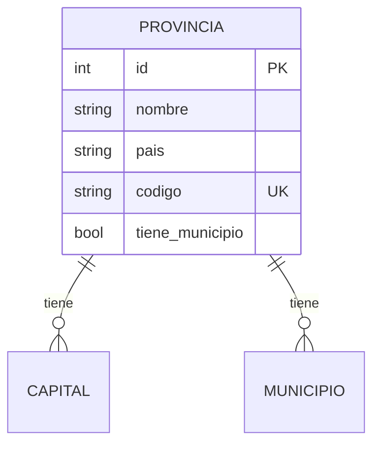
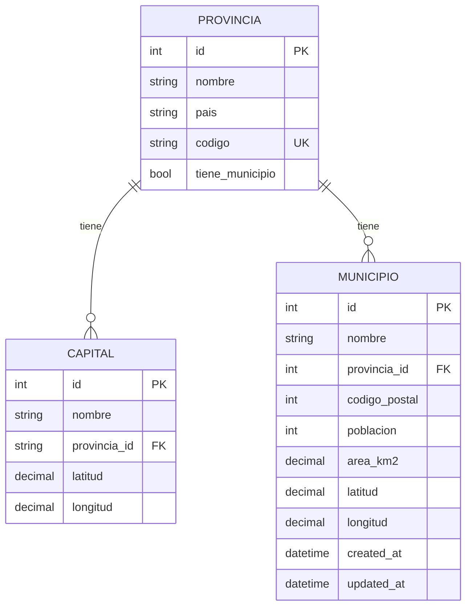
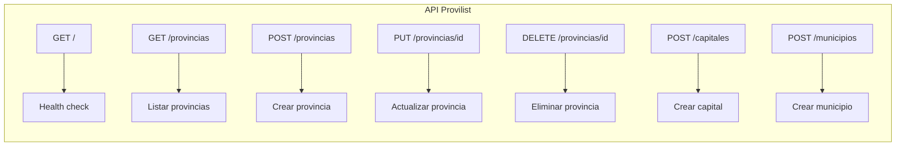
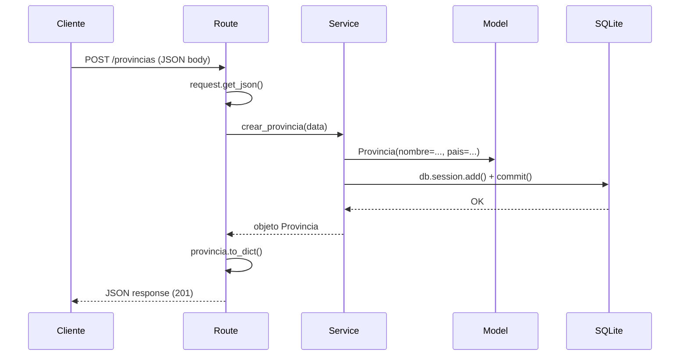
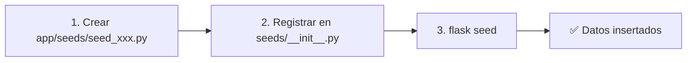
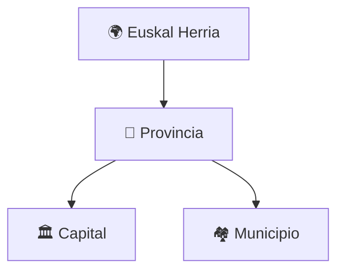
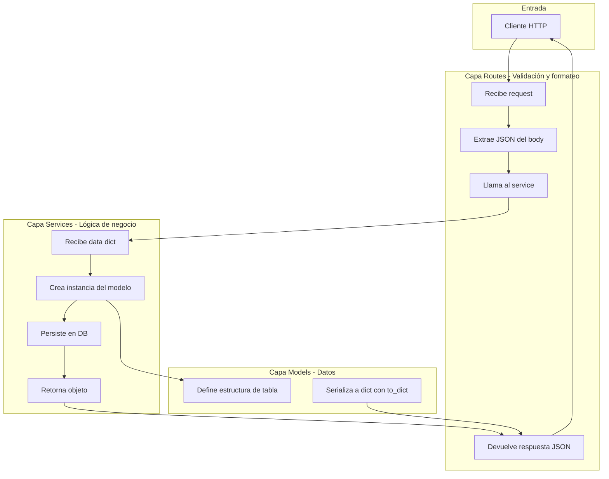

# 📖 Documentación Técnica — Provilist

> [!NOTE]
> Documentación detallada de la aplicación Provilist: rutas, modelos, servicios, `__init__.py`, migraciones, seeds y lógica de negocio.

---

## 📋 Índice

1. [Modelos (Models)](#1-modelos-models)
2. [Rutas (Routes)](#2-rutas-routes)
3. [Servicios (Services)](#3-servicios-services)
4. [Archivos \_\_init\_\_.py](#4-archivos-__init__py)
5. [Migraciones](#5-migraciones)
6. [Seeds](#6-seeds)
7. [Lógica de Negocio](#7-lógica-de-negocio)

---

## 1. Modelos (Models)

📁 Archivo: [app/models.py](file:///home/penascalf5/Escritorio/CURSO%20FULLSTACK/PYTHON/Provilist/app/models.py)

Todos los modelos están definidos en un único archivo. Cada modelo hereda de `db.Model` (SQLAlchemy) y representa una tabla en la base de datos SQLite.

---

### 1.1 Modelo `Provincia`

| Campo | Tipo | Restricciones | Descripción |
|---|---|---|---|
| `id` | `Integer` | PK, autoincremental | Identificador único |
| `nombre` | `String(100)` | NOT NULL | Nombre de la provincia |
| `pais` | `String(10)` | NOT NULL | País al que pertenece |
| `codigo` | `String(2)` | NOT NULL, UNIQUE | Código de 2 letras (ej: `"BI"`) |
| `tiene_municipio` | `Boolean` | NOT NULL, default=False | Si tiene municipios cargados |

**Relaciones:**



- `capital` → relación **1 a muchos** con `Capital` (una provincia tiene muchas capitales)
- `municipio` → relación **1 a muchos** con `Municipio` (una provincia tiene muchos municipios)

**Método `to_dict()`:**
```python
def to_dict(self):
    return {
        "id": self.id,
        "nombre": self.nombre,
        "pais": self.pais,
        "codigo": self.codigo,
        "tiene_municipio": self.tiene_municipio
    }
```

---

### 1.2 Modelo `Capital`

| Campo | Tipo | Restricciones | Descripción |
|---|---|---|---|
| `id` | `Integer` | PK, autoincremental | Identificador único |
| `nombre` | `String(100)` | NOT NULL | Nombre de la capital |
| `provincia_id` | `String(2)` | FK → `provincias.id`, NOT NULL | ID de la provincia |
| `latitud` | `Numeric(9,6)` | nullable | Coordenada de latitud |
| `longitud` | `Numeric(9,6)` | nullable | Coordenada de longitud |

**Relación inversa:** Accede a la provincia padre con `self.Provincia` (backref definido en el modelo `Provincia`).

**Método `to_dict()`:**
```python
def to_dict(self):
    return {
        "id": self.id,
        "nombre": self.nombre,
        "provincia_id": self.provincia_id,
        "nombre_provincia": self.Provincia.nombre,  # ← usa el backref
        "latitud": self.latitud,
        "longitud": self.longitud
    }
```

---

### 1.3 Modelo `Municipio`

| Campo | Tipo | Restricciones | Descripción |
|---|---|---|---|
| `id` | `Integer` | PK, autoincremental | Identificador único |
| `nombre` | `String(100)` | NOT NULL | Nombre del municipio |
| `provincia_id` | `Integer` | FK → `provincias.id`, NOT NULL | ID de la provincia |
| `codigo_postal` | `Integer` | NOT NULL | Código postal |
| `poblacion` | `Integer` | NOT NULL | Número de habitantes |
| `area_km2` | `Numeric(10,2)` | nullable | Superficie en km² |
| `latitud` | `Numeric(9,6)` | nullable | Coordenada de latitud |
| `longitud` | `Numeric(9,6)` | nullable | Coordenada de longitud |
| `created_at` | `DateTime` | NOT NULL, auto | Fecha de creación |
| `updated_at` | `DateTime` | nullable, auto | Fecha de última actualización |

**Relación inversa:** Accede a la provincia con `self.Provincia` (backref).

**Método `to_dict()`:**
```python
def to_dict(self):
    return {
        "id": self.id,
        "nombre": self.nombre,
        "provincia_id": self.provincia_id,
        "nombre_provincia": self.Provincia.nombre,  # ← usa el backref
        "codigo_postal": self.codigo_postal,
        "poblacion": self.poblacion,
        "area_km2": self.area_km2,
        "latitud": self.latitud,
        "longitud": self.longitud,
        "created_at": self.created_at,
        "updated_at": self.updated_at
    }
```

---

### Diagrama completo de relaciones



---

## 2. Rutas (Routes)

📁 Carpeta: `app/routes/`

Las rutas están organizadas por recurso usando **Blueprints** de Flask. Cada Blueprint agrupa los endpoints de una entidad.

---

### 2.1 Blueprint `main` — Ruta raíz

📁 Archivo: [app/routes/\_\_init\_\_.py](file:///home/penascalf5/Escritorio/CURSO%20FULLSTACK/PYTHON/Provilist/app/routes/__init__.py)

| Método | Endpoint | Descripción | Respuesta |
|---|---|---|---|
| `GET` | `/` | Health check de la API | `{"mensaje": "API funcionando"}` |

---

### 2.2 Blueprint `provincia_bp` — Provincias

📁 Archivo: [app/routes/provincia_routes.py](file:///home/penascalf5/Escritorio/CURSO%20FULLSTACK/PYTHON/Provilist/app/routes/provincia_routes.py)

| Método | Endpoint | Función | Código de respuesta |
|---|---|---|---|
| `GET` | `/provincias` | Listar todas las provincias | `200 OK` |
| `POST` | `/provincias` | Crear una nueva provincia | `201 Created` |
| `PUT` | `/provincias/<id>` | Actualizar una provincia existente | `200 OK` / `404 Not Found` |
| `DELETE` | `/provincias/<id>` | Eliminar una provincia | `200 OK` / `404 Not Found` |

#### Detalle de cada endpoint:

**`GET /provincias`**
- **Parámetros:** Ninguno
- **Respuesta exitosa (200):**
```json
[
  {
    "id": 1,
    "nombre": "Bizkaia",
    "pais": "Euskal Herria",
    "codigo": "BI",
    "tiene_municipio": true
  }
]
```

**`POST /provincias`**
- **Body (JSON):**
```json
{
  "nombre": "Bizkaia",
  "pais": "Euskal Herria",
  "codigo": "BI",
  "tiene_municipio": true
}
```
- **Respuesta exitosa (201):** El objeto provincia creado.

**`PUT /provincias/<id>`**
- **Parámetro URL:** `id` (entero) — ID de la provincia
- **Body (JSON):** Campos a actualizar (parcial o completo)
```json
{
  "nombre": "Bizkaia Actualizada"
}
```
- **Respuesta exitosa (200):** El objeto provincia actualizado.
- **Respuesta error (404):** `{"error": "Provincia no encontrada"}`

**`DELETE /provincias/<id>`**
- **Parámetro URL:** `id` (entero) — ID de la provincia
- **Respuesta exitosa (200):** `{"mensaje": "Provincia eliminada correctamente"}`
- **Respuesta error (404):** `{"error": "Provincia no encontrado"}`

---

### 2.3 Blueprint `capital_bp` — Capitales

📁 Archivo: [app/routes/capital_routes.py](file:///home/penascalf5/Escritorio/CURSO%20FULLSTACK/PYTHON/Provilist/app/routes/capital_routes.py)

| Método | Endpoint | Función | Código de respuesta |
|---|---|---|---|
| `POST` | `/capitales` | Crear una nueva capital | `201 Created` |

**`POST /capitales`**
- **Body (JSON):**
```json
{
  "nombre": "Bilbao",
  "provincia_id": 1,
  "latitud": 43.263012,
  "longitud": -2.934985
}
```
- **Respuesta exitosa (201):** El objeto capital creado con `nombre_provincia` incluido.

---

### 2.4 Blueprint `municipio_bp` — Municipios

📁 Archivo: [app/routes/municipio_routes.py](file:///home/penascalf5/Escritorio/CURSO%20FULLSTACK/PYTHON/Provilist/app/routes/municipio_routes.py)

| Método | Endpoint | Función | Código de respuesta |
|---|---|---|---|
| `POST` | `/municipios` | Crear un nuevo municipio | `201 Created` |

**`POST /municipios`**
- **Body (JSON):**
```json
{
  "nombre": "Getxo",
  "provincia_id": 1,
  "codigo_postal": 48930,
  "poblacion": 78282,
  "area_km2": 11.73,
  "latitud": 43.356789,
  "longitud": -3.012345,
  "create_at": "2026-03-27T12:00:00",
  "updated_at": "2026-03-27T12:00:00"
}
```
- **Respuesta exitosa (201):** El objeto municipio creado.

---

### Resumen visual de todos los endpoints



---

## 3. Servicios (Services)

📁 Carpeta: `app/services/`

La capa de servicios contiene la **lógica de negocio** y se encarga de interactuar con los modelos y la base de datos. Las rutas **nunca** acceden directamente a `db.session`.

---

### 3.1 `provincia_service.py`

📁 Archivo: [app/services/provincia_service.py](file:///home/penascalf5/Escritorio/CURSO%20FULLSTACK/PYTHON/Provilist/app/services/provincia_service.py)

| Función | Parámetros | Retorna | Descripción |
|---|---|---|---|
| `crear_provincia(data)` | `dict` con nombre, pais, codigo, tiene_municipio | Objeto `Provincia` | Crea y guarda una nueva provincia |
| `actualizar_provincia(id, data)` | `int`, `dict` parcial | `Provincia` o `None` | Actualiza campos. Retorna `None` si no existe |
| `eliminar_provincia(id)` | `int` | `True` o `False` | Elimina la provincia. `False` si no existe |
| `obtener_provincias()` | — | `list[dict]` | Devuelve todas las provincias como diccionarios |

**Ejemplo — `crear_provincia`:**
```python
def crear_provincia(data):
    nueva_provincia = Provincia(
        nombre=data["nombre"],
        pais=data["pais"],
        codigo=data["codigo"],
        tiene_municipio=data["tiene_municipio"]
    )
    db.session.add(nueva_provincia)
    db.session.commit()
    return nueva_provincia
```

**Ejemplo — `actualizar_provincia`:**
```python
def actualizar_provincia(id, data):
    provincia = Provincia.query.get(id)
    if not provincia:
        return None
    # Solo actualiza los campos que vengan en el body,
    # si no viene un campo, mantiene el valor actual
    provincia.nombre = data.get("nombre", provincia.nombre)
    provincia.pais = data.get("puesto", provincia.pais)
    provincia.codigo = data.get("codigo", provincia.codigo)
    provincia.tiene_municipio = data.get("tiene_municipio", provincia.tiene_municipio)
    db.session.commit()
    return provincia
```

> [!NOTE]
> Se usa `data.get("campo", valor_actual)` para que la actualización sea **parcial**: solo se cambian los campos que el cliente envía.

---

### 3.2 `capital_service.py`

📁 Archivo: [app/services/capital_service.py](file:///home/penascalf5/Escritorio/CURSO%20FULLSTACK/PYTHON/Provilist/app/services/capital_service.py)

| Función | Parámetros | Retorna | Descripción |
|---|---|---|---|
| `crear_capital(data)` | `dict` con nombre, provincia_id, latitud, longitud | Objeto `Capital` | Crea y guarda una nueva capital |

---

### 3.3 `municipio_service.py`

📁 Archivo: [app/services/municipio_service.py](file:///home/penascalf5/Escritorio/CURSO%20FULLSTACK/PYTHON/Provilist/app/services/municipio_service.py)

| Función | Parámetros | Retorna | Descripción |
|---|---|---|---|
| `crear_municipio(data)` | `dict` con nombre, provincia_id, codigo_postal, poblacion, area_km2, latitud, longitud, create_at, updated_at | Objeto `Municipio` | Crea y guarda un nuevo municipio |

---

### Flujo completo de una petición



---

## 4. Archivos `__init__.py`

Los archivos `__init__.py` tienen una función clave en Python: **marcan un directorio como un paquete**. Pero en este proyecto hacen más que eso:

### 4.1 `app/__init__.py` — Factory de la App

📁 [app/\_\_init\_\_.py](file:///home/penascalf5/Escritorio/CURSO%20FULLSTACK/PYTHON/Provilist/app/__init__.py)

**Función:** Crear y configurar la aplicación Flask.

**¿Qué hace exactamente?**
1. Instancia `db` (SQLAlchemy) y `migrate` (Flask-Migrate) **sin vincular a la app**.
2. Define la función `create_app()` que:
   - Crea la app Flask.
   - Carga la configuración desde `app.config.Config`.
   - Vincula `db` y `migrate` con la app.
   - Importa y registra todos los Blueprints.
   - Devuelve la app configurada.

**¿Por qué `db` se crea fuera de `create_app`?**
Para que otros módulos (models, services, seeds) puedan hacer `from app import db` sin importar la app completa.

---

### 4.2 `app/routes/__init__.py` — Hub de Rutas

📁 [app/routes/\_\_init\_\_.py](file:///home/penascalf5/Escritorio/CURSO%20FULLSTACK/PYTHON/Provilist/app/routes/__init__.py)

**Función:** Punto central de exportación de todos los Blueprints.

**¿Qué hace?**
1. Crea el Blueprint `main` con la ruta raíz `/`.
2. Re-exporta los Blueprints de los demás archivos:
   - `provincia_bp` desde `provincia_routes.py`
   - `municipio_bp` desde `municipio_routes.py`
   - `capital_bp` desde `capital_routes.py`

**¿Por qué?** Para que `app/__init__.py` solo necesite importar desde `app.routes` en lugar de importar cada archivo por separado.

---

### 4.3 `app/services/__init__.py` — Vacío

📁 [app/services/\_\_init\_\_.py](file:///home/penascalf5/Escritorio/CURSO%20FULLSTACK/PYTHON/Provilist/app/services/__init__.py)

**Función:** Solo marca el directorio como paquete Python. No define nada. Los services se importan directamente: `from ..services.provincia_service import crear_provincia`.

---

### 4.4 `app/seeds/__init__.py` — Orquestador de Seeds

📁 [app/seeds/\_\_init\_\_.py](file:///home/penascalf5/Escritorio/CURSO%20FULLSTACK/PYTHON/Provilist/app/seeds/__init__.py)

**Función:** Importa y ejecuta todos los seeds en orden.

```python
from .seed_provincias import seed_provincias

def run_seeds():
    seed_provincias()
```

**¿Por qué?** Para tener un único punto de entrada (`run_seeds()`) que ejecute todos los seeds. Al crear nuevos seeds, solo hay que añadirlos aquí.

---

## 5. Migraciones

📁 Carpeta: `migrations/`

Las migraciones gestionan los **cambios en la estructura de la base de datos** de forma versionada, usando **Flask-Migrate** (wrapper de **Alembic**).

### 5.1 Archivos importantes

| Archivo | Descripción |
|---|---|
| `migrations/env.py` | Configuración del entorno de Alembic. Conecta con Flask y la DB |
| `migrations/alembic.ini` | Configuración de logging de Alembic |
| `migrations/script.py.mako` | Template para generar nuevas migraciones automáticamente |
| `migrations/versions/` | Carpeta con los archivos de migración |

### 5.2 Migración existente

📁 Archivo: [migrations/versions/2cb3fcaf67be_initial_tables.py](file:///home/penascalf5/Escritorio/CURSO%20FULLSTACK/PYTHON/Provilist/migrations/versions/2cb3fcaf67be_initial_tables.py)

**Nombre:** `Initial tables`
**Fecha:** 2026-03-27

**¿Qué hace?**
- **`upgrade()`** — Crea las 3 tablas: `provincias`, `capitales`, `municipios`
- **`downgrade()`** — Elimina las 3 tablas en orden inverso (para revertir)

> [!IMPORTANT]
> Alembic genera las migraciones **automáticamente** comparando los modelos de Python con el estado actual de la base de datos.

---

### 5.3 Comandos de migraciones

```bash
# Ver el estado actual de las migraciones
flask db current

# Ver el historial de migraciones
flask db history

# Crear una nueva migración automática
flask db migrate -m "Descripción del cambio"

# Aplicar migraciones pendientes
flask db upgrade

# Revertir la última migración
flask db downgrade
```

---

### 5.4 🆕 Cómo crear una nueva migración

Sigue estos pasos cuando necesites hacer cambios en la base de datos:

#### Paso 1 — Modificar el modelo

Edita `app/models.py`. Ejemplo: añadir un campo `email` al modelo `Capital`:

```python
class Capital(db.Model):
    __tablename__ = "capitales"

    id = db.Column(db.Integer, primary_key=True)
    nombre = db.Column(db.String(100), nullable=False)
    provincia_id = db.Column(db.String(2), db.ForeignKey('provincias.id'), nullable=False)
    latitud = db.Column(db.Numeric(9,6), nullable=True)
    longitud = db.Column(db.Numeric(9,6), nullable=True)
    email = db.Column(db.String(150), nullable=True)  # ← NUEVO CAMPO
```

#### Paso 2 — Generar la migración

```bash
flask db migrate -m "Agregar email a capitales"
```

Esto crea un nuevo archivo en `migrations/versions/` con las instrucciones `upgrade()` y `downgrade()`.

#### Paso 3 — Revisar la migración generada

Abre el archivo nuevo en `migrations/versions/` y verifica que los cambios sean correctos.

#### Paso 4 — Aplicar la migración

```bash
flask db upgrade
```

> [!WARNING]
> **Siempre revisa** el archivo de migración generado antes de aplicarlo. Alembic no siempre detecta todos los cambios correctamente (por ejemplo, cambios en nombres de columnas).

#### Resumen visual


---

## 6. Seeds

📁 Carpeta: `app/seeds/`

Los seeds permiten **poblar la base de datos con datos iniciales** de forma reproducible.

### 6.1 Seed existente: `seed_provincias.py`

📁 Archivo: [app/seeds/seed_provincias.py](file:///home/penascalf5/Escritorio/CURSO%20FULLSTACK/PYTHON/Provilist/app/seeds/seed_provincias.py)

**¿Qué hace?**
Inserta las 7 provincias de Euskal Herria:

| Nombre | País | Código | Tiene Municipios |
|---|---|---|---|
| Bizkaia | Euskal Herria | BI | ✅ |
| Gipuzkoa | Euskal Herria | GI | ✅ |
| Álava | Euskal Herria | AL | ✅ |
| Navarra | Euskal Herria | NA | ✅ |
| Lapurdi | Euskal Herria | LP | ❌ |
| Zuberoa | Euskal Herria | ZU | ❌ |
| Baja Navarra | Euskal Herria | BN | ❌ |

**Mecanismo anti-duplicados:**
```python
existe = Provincia.query.filter_by(codigo=data["codigo"]).first()
if existe:
    continue  # ← si ya existe, no la inserta de nuevo
```

> [!NOTE]
> Los seeds son **idempotentes**: puedes ejecutarlos múltiples veces sin crear duplicados.

---

### 6.2 Cómo ejecutar los seeds

Actualmente los seeds están **comentados** en `run.py`. Para activarlos:

#### Opción 1 — Comando CLI de Flask

Descomenta estas líneas en [run.py](file:///home/penascalf5/Escritorio/CURSO%20FULLSTACK/PYTHON/Provilist/run.py):

```python
from app import create_app, db
from app.seeds import run_seeds

app = create_app()

@app.cli.command("seed")
def seed():
    """Ejecuta los seeds"""
    run_seeds()
    print("Seeds ejecutados correctamente")
```

Luego ejecuta:

```bash
flask seed
```

#### Opción 2 — Ejecutar directamente desde Python

```bash
python -c "
from app import create_app
from app.seeds import run_seeds
app = create_app()
with app.app_context():
    run_seeds()
    print('Seeds ejecutados')
"
```

---

### 6.3 🆕 Cómo crear un nuevo seed

#### Paso 1 — Crear el archivo del seed

Crea un nuevo archivo en `app/seeds/`. Ejemplo: `seed_capitales.py`:

```python
from app.models import Capital
from app import db

capitales_seed = [
    {"nombre": "Bilbao", "provincia_id": 1, "latitud": 43.263012, "longitud": -2.934985},
    {"nombre": "Donostia", "provincia_id": 2, "latitud": 43.318334, "longitud": -1.981231},
    {"nombre": "Gasteiz", "provincia_id": 3, "latitud": 42.846920, "longitud": -2.672530},
    {"nombre": "Iruñea", "provincia_id": 4, "latitud": 42.812526, "longitud": -1.645775},
]

def seed_capitales():
    for data in capitales_seed:
        # Evitar duplicados buscando por nombre
        existe = Capital.query.filter_by(nombre=data["nombre"]).first()
        if existe:
            continue

        capital = Capital(
            nombre=data["nombre"],
            provincia_id=data["provincia_id"],
            latitud=data["latitud"],
            longitud=data["longitud"]
        )

        db.session.add(capital)

    db.session.commit()
```

#### Paso 2 — Registrar el seed en `app/seeds/__init__.py`

```python
from .seed_provincias import seed_provincias
from .seed_capitales import seed_capitales  # ← NUEVO

def run_seeds():
    seed_provincias()     # Primero provincias (porque capitales depende de ellas)
    seed_capitales()      # ← NUEVO
```

> [!IMPORTANT]
> **El orden importa.** Los seeds con dependencias de clave foránea deben ejecutarse después de los seeds de los que dependen. Ejemplo: `seed_capitales` necesita que `seed_provincias` se ejecute primero.

#### Paso 3 — Ejecutar

```bash
flask seed
```

#### Resumen visual



#### Patrón para todo seed nuevo

```python
from app.models import MiModelo
from app import db

datos_seed = [
    {"campo1": "valor1", "campo2": "valor2"},
    # ... más datos
]

def seed_mi_modelo():
    for data in datos_seed:
        # 1. Verificar duplicados
        existe = MiModelo.query.filter_by(campo_unico=data["campo_unico"]).first()
        if existe:
            continue

        # 2. Crear instancia
        nuevo = MiModelo(**data)

        # 3. Añadir a la sesión
        db.session.add(nuevo)

    # 4. Guardar todo al final
    db.session.commit()
```

---

## 7. Lógica de Negocio

### 7.1 Dominio

Provilist gestiona la información geográfica de **Euskal Herria** (País Vasco), organizada en 3 niveles:



- **Provincia**: Unidad territorial principal (ej: Bizkaia, Gipuzkoa)
- **Capital**: Ciudad principal de una provincia (ej: Bilbao es capital de Bizkaia)
- **Municipio**: Subdivisión de una provincia (ej: Getxo pertenece a Bizkaia)

### 7.2 Reglas de negocio actuales

| Regla | Implementación |
|---|---|
| Cada provincia tiene un código único de 2 letras | `codigo` es `UNIQUE` en el modelo |
| No todas las provincias tienen municipios cargados | Campo `tiene_municipio` (Boolean) |
| Capital y Municipio siempre pertenecen a una Provincia | FK obligatoria (`nullable=False`) |
| Los municipios registran cuándo fueron creados/actualizados | `created_at` y `updated_at` automáticos |
| Las coordenadas son opcionales | `latitud` y `longitud` son `nullable=True` |
| Los seeds no crean duplicados | Verificación por `codigo` antes de insertar |

### 7.3 Flujo de datos de la aplicación



> [!TIP]
> La separación en 3 capas (Routes → Services → Models) facilita:
> - **Testing**: Puedes testear los services sin necesidad de HTTP.
> - **Reutilización**: Un service puede ser usado por múltiples rutas.
> - **Mantenimiento**: Los cambios en la lógica de negocio no afectan a las rutas y viceversa.
