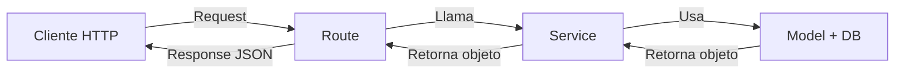
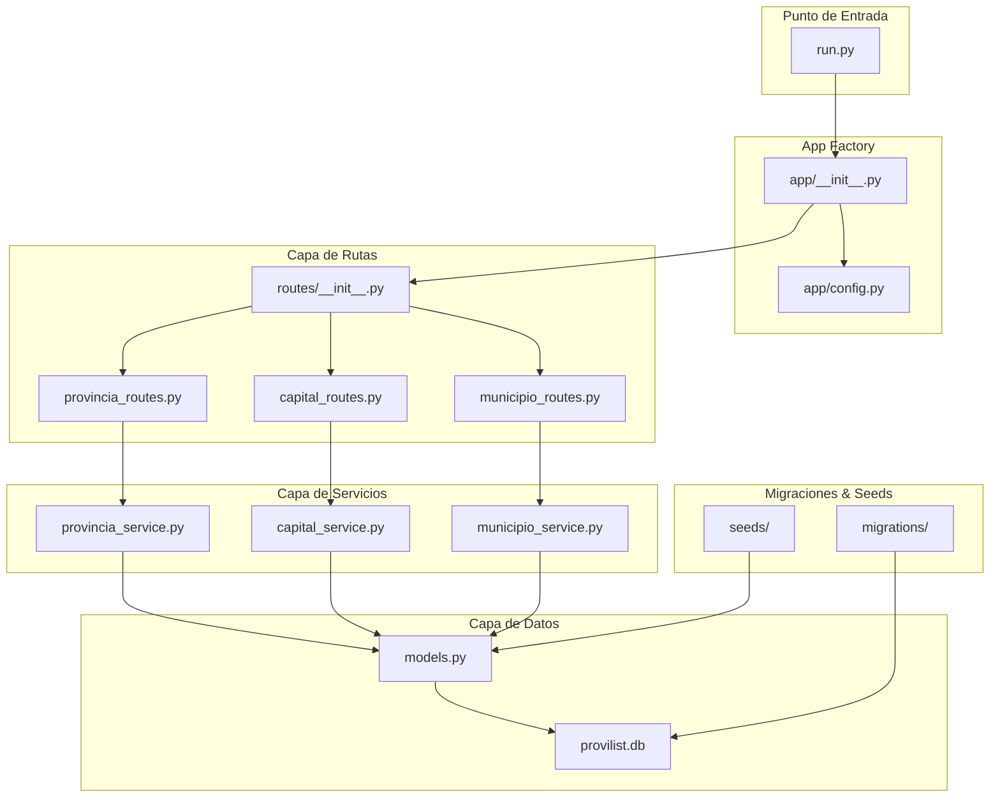

# 📘 Manual de Creación — Provilist

> [!NOTE]
> Este manual describe paso a paso cómo se construyó el proyecto **Provilist** desde cero. Sirve como guía para replicar la estructura o entender las decisiones tomadas durante el desarrollo.

---

## 📋 Índice

1. [¿Qué es Provilist?](#1-qué-es-provilist)
2. [Requisitos Previos](#2-requisitos-previos)
3. [Paso 1 — Crear la carpeta del proyecto](#paso-1--crear-la-carpeta-del-proyecto)
4. [Paso 2 — Crear el entorno virtual](#paso-2--crear-el-entorno-virtual)
5. [Paso 3 — Instalar las dependencias](#paso-3--instalar-las-dependencias)
6. [Paso 4 — Crear la estructura de carpetas](#paso-4--crear-la-estructura-de-carpetas)
7. [Paso 5 — Configurar la aplicación Flask](#paso-5--configurar-la-aplicación-flask)
8. [Paso 6 — Definir la configuración de la base de datos](#paso-6--definir-la-configuración-de-la-base-de-datos)
9. [Paso 7 — Crear los modelos](#paso-7--crear-los-modelos)
10. [Paso 8 — Crear las rutas (Routes)](#paso-8--crear-las-rutas-routes)
11. [Paso 9 — Crear los servicios (Services)](#paso-9--crear-los-servicios-services)
12. [Paso 10 — Crear los seeds](#paso-10--crear-los-seeds)
13. [Paso 11 — Configurar las migraciones](#paso-11--configurar-las-migraciones)
14. [Paso 12 — Crear el punto de entrada](#paso-12--crear-el-punto-de-entrada)
15. [Paso 13 — Ejecutar la aplicación](#paso-13--ejecutar-la-aplicación)
16. [Resumen de la Arquitectura](#resumen-de-la-arquitectura)

---

## 1. ¿Qué es Provilist?

**Provilist** es una API REST construida con **Flask** (Python) que gestiona información geográfica de **provincias**, **capitales** y **municipios** de Euskal Herria. Utiliza **SQLAlchemy** como ORM y **Flask-Migrate** (Alembic) para el control de versiones de la base de datos.

### Tecnologías principales

| Tecnología | Versión | Función |
|---|---|---|
| Python | 3.12 | Lenguaje de programación |
| Flask | 3.1.3 | Framework web |
| Flask-SQLAlchemy | 3.1.1 | ORM para la base de datos |
| SQLAlchemy | 2.0.48 | Motor ORM |
| Flask-Migrate | 4.1.0 | Migraciones de base de datos |
| Alembic | 1.18.4 | Motor de migraciones |
| SQLite | — | Base de datos (fichero local) |

---

## 2. Requisitos Previos

Antes de empezar necesitas tener instalado:

- **Python 3.12** o superior
- **pip** (administrador de paquetes de Python)
- Un editor de código (VS Code recomendado)
- Terminal / consola de comandos

---

## Paso 1 — Crear la carpeta del proyecto

```bash
mkdir Provilist
cd Provilist
```

> [!TIP]
> Es buena práctica nombrar la carpeta raíz del proyecto con la primera letra en mayúscula.

---

## Paso 2 — Crear el entorno virtual

El entorno virtual aísla las dependencias del proyecto del sistema operativo.

```bash
python3 -m venv provilistEnv
```

Esto crea la carpeta `provilistEnv/` con el intérprete de Python y pip aislados.

### Activar el entorno virtual

```bash
# Linux / Mac
source provilistEnv/bin/activate

# Windows
provilistEnv\Scripts\activate
```

> [!IMPORTANT]
> **Siempre** activa el entorno virtual antes de trabajar en el proyecto. Si ves `(provilistEnv)` al inicio de tu terminal, está activado.

---

## Paso 3 — Instalar las dependencias

Con el entorno virtual activado, instala las librerías necesarias:

```bash
pip install Flask Flask-SQLAlchemy Flask-Migrate
```

Luego genera el archivo `requirements.txt` para que otros desarrolladores puedan replicar el entorno:

```bash
pip freeze > requirements.txt
```

El archivo resultante contiene:

```
alembic==1.18.4
blinker==1.9.0
click==8.3.1
Flask==3.1.3
Flask-Migrate==4.1.0
Flask-SQLAlchemy==3.1.1
greenlet==3.3.2
itsdangerous==2.2.0
Jinja2==3.1.6
Mako==1.3.10
MarkupSafe==3.0.3
SQLAlchemy==2.0.48
typing_extensions==4.15.0
Werkzeug==3.1.7
```

> [!TIP]
> Si clonas el proyecto y quieres instalar todas las dependencias, ejecuta:
> ```bash
> pip install -r requirements.txt
> ```

---

## Paso 4 — Crear la estructura de carpetas

La estructura del proyecto sigue una **arquitectura de 3 capas**: Routes → Services → Models.

```bash
mkdir -p app/routes app/services app/seeds
touch app/__init__.py
touch app/config.py
touch app/models.py
touch app/routes/__init__.py
touch app/services/__init__.py
touch app/seeds/__init__.py
touch run.py
touch .gitignore
```

### Estructura final del proyecto

```
Provilist/
├── run.py                    # 🚀 Punto de entrada de la app
├── requirements.txt          # 📦 Dependencias del proyecto
├── .gitignore                # 🚫 Archivos ignorados por Git
├── provilist.db              # 🗄️ Base de datos SQLite (generada)
├── provilistEnv/             # 🐍 Entorno virtual (NO se sube a Git)
├── app/
│   ├── __init__.py           # 🏭 Factory de la aplicación Flask
│   ├── config.py             # ⚙️ Configuración (DB, etc.)
│   ├── models.py             # 📊 Modelos de datos (SQLAlchemy)
│   ├── routes/
│   │   ├── __init__.py       # 📡 Blueprint principal + re-exporta BPs
│   │   ├── provincia_routes.py
│   │   ├── capital_routes.py
│   │   └── municipio_routes.py
│   ├── services/
│   │   ├── __init__.py       # (vacío, marca como paquete)
│   │   ├── provincia_service.py
│   │   ├── capital_service.py
│   │   └── municipio_service.py
│   └── seeds/
│       ├── __init__.py       # 🌱 Orquesta la ejecución de seeds
│       └── seed_provincias.py
└── migrations/
    ├── alembic.ini           # Configuración de Alembic
    ├── env.py                # Entorno de ejecución de migraciones
    ├── script.py.mako        # Template para generar migraciones
    ├── README
    └── versions/
        └── 2cb3fcaf67be_initial_tables.py  # Primera migración
```

---

## Paso 5 — Configurar la aplicación Flask

El archivo [app/\_\_init\_\_.py](file:///home/penascalf5/Escritorio/CURSO%20FULLSTACK/PYTHON/Provilist/app/__init__.py) usa el **patrón Factory** para crear la app:

```python
from flask import Flask
from flask_sqlalchemy import SQLAlchemy
from flask_migrate import Migrate

# Se instancian FUERA de create_app para poder importarlos desde otros módulos
db = SQLAlchemy()
migrate = Migrate()

def create_app():
    app = Flask(__name__)
    app.config.from_object("app.config.Config")

    # Vinculamos las extensiones con la app
    db.init_app(app)
    migrate.init_app(app, db)

    # Importamos y registramos los Blueprints
    from .routes import main, provincia_bp, municipio_bp, capital_bp
    app.register_blueprint(main)
    app.register_blueprint(provincia_bp)
    app.register_blueprint(municipio_bp)
    app.register_blueprint(capital_bp)

    return app
```

### ¿Por qué el patrón Factory?

- **Evita imports circulares**: `db` y `migrate` se crean sin app, y se vinculan después.
- **Escalabilidad**: Puedes crear múltiples instancias de la app (para tests, por ejemplo).
- **Orden**: La configuración, extensiones y blueprints se registran en un solo lugar.

---

## Paso 6 — Definir la configuración de la base de datos

El archivo [app/config.py](file:///home/penascalf5/Escritorio/CURSO%20FULLSTACK/PYTHON/Provilist/app/config.py) centraliza la configuración:

```python
import os

class Config:
    # Obtiene la ruta absoluta de la carpeta actual
    BASE_DIR = os.path.abspath(os.path.dirname(__file__))

    # Define dónde se guardará el archivo SQLite
    SQLALCHEMY_DATABASE_URI = 'sqlite:///' + os.path.join(BASE_DIR, '../provilist.db')

    # Desactiva una función de SQLAlchemy que consume mucha memoria
    SQLALCHEMY_TRACK_MODIFICATIONS = False
```

| Variable | Descripción |
|---|---|
| `BASE_DIR` | Ruta absoluta de la carpeta `app/` |
| `SQLALCHEMY_DATABASE_URI` | Ruta al archivo `provilist.db` en la raíz del proyecto |
| `SQLALCHEMY_TRACK_MODIFICATIONS` | Desactivado por rendimiento (no necesitamos tracking de cambios) |

---

## Paso 7 — Crear los modelos

Los modelos se definen en [app/models.py](file:///home/penascalf5/Escritorio/CURSO%20FULLSTACK/PYTHON/Provilist/app/models.py). Se crearon **3 modelos**:

### Modelo `Provincia`
- Tabla: `provincias`
- Campos: `id`, `nombre`, `pais`, `codigo` (único), `tiene_municipio`
- Relaciones: Una provincia tiene muchas `Capital` y muchos `Municipio`

### Modelo `Capital`
- Tabla: `capitales`
- Campos: `id`, `nombre`, `provincia_id` (FK), `latitud`, `longitud`
- Relación: Pertenece a una `Provincia`

### Modelo `Municipio`
- Tabla: `municipios`
- Campos: `id`, `nombre`, `provincia_id` (FK), `codigo_postal`, `poblacion`, `area_km2`, `latitud`, `longitud`, `created_at`, `updated_at`
- Relación: Pertenece a una `Provincia`

> [!IMPORTANT]
> Cada modelo incluye un método `to_dict()` que convierte el objeto en diccionario para poder devolverlo como JSON en las respuestas de la API.

---

## Paso 8 — Crear las rutas (Routes)

Las rutas se organizan por **Blueprint** en la carpeta `app/routes/`:

1. **`__init__.py`** — Crea el Blueprint `main` con la ruta raíz (`/`) y re-exporta los demás Blueprints.
2. **`provincia_routes.py`** — CRUD completo de provincias.
3. **`capital_routes.py`** — Creación de capitales.
4. **`municipio_routes.py`** — Creación de municipios.

> [!TIP]
> Los Blueprints permiten modularizar la app. Cada archivo de rutas es independiente y se registra en el `__init__.py` de la app.

---

## Paso 9 — Crear los servicios (Services)

Los servicios contienen la **lógica de negocio** y la **interacción con la base de datos**. Están en `app/services/`:

1. **`provincia_service.py`** — `crear_provincia`, `actualizar_provincia`, `eliminar_provincia`, `obtener_provincias`
2. **`capital_service.py`** — `crear_capital`
3. **`municipio_service.py`** — `crear_municipio`

### Flujo de una petición



---

## Paso 10 — Crear los seeds

Los seeds permiten **poblar la base de datos con datos iniciales**. Están en `app/seeds/`:

1. **`seed_provincias.py`** — Inserta las 7 provincias de Euskal Herria.
2. **`__init__.py`** — Función `run_seeds()` que orquesta la ejecución de todos los seeds.

```bash
# Para ejecutar los seeds (descomentar en run.py primero):
flask seed
```

---

## Paso 11 — Configurar las migraciones

Las migraciones se inicializaron con Flask-Migrate:

```bash
# 1. Inicializar el directorio de migraciones (solo una vez)
flask db init

# 2. Generar la primera migración basada en los modelos
flask db migrate -m "Initial tables"

# 3. Aplicar la migración a la base de datos
flask db upgrade
```

Esto creó:
- La carpeta `migrations/` con la configuración de Alembic
- El archivo `migrations/versions/2cb3fcaf67be_initial_tables.py` con la migración inicial
- El archivo `provilist.db` con las tablas creadas

---

## Paso 12 — Crear el punto de entrada

El archivo [run.py](file:///home/penascalf5/Escritorio/CURSO%20FULLSTACK/PYTHON/Provilist/run.py) arranca la aplicación:

```python
from app import create_app, db

app = create_app()

if __name__ == "__main__":
    app.run(debug=True)
```

> [!NOTE]
> `debug=True` activa el modo debug de Flask, que recarga automáticamente la app cuando detecta cambios en el código. **No usar en producción.**

---

## Paso 13 — Ejecutar la aplicación

```bash
# 1. Asegúrate de que el entorno virtual está activado
source provilistEnv/bin/activate

# 2. Ejecuta la app
python run.py
```

La API estará disponible en: `http://127.0.0.1:5000`

### Probar la API

```bash
# Verificar que funciona
curl http://127.0.0.1:5000/
# Respuesta: {"mensaje": "API funcionando"}

# Obtener todas las provincias
curl http://127.0.0.1:5000/provincias

# Crear una provincia
curl -X POST http://127.0.0.1:5000/provincias \
  -H "Content-Type: application/json" \
  -d '{"nombre": "Bizkaia", "pais": "Euskal Herria", "codigo": "BI", "tiene_municipio": true}'
```

---

## Resumen de la Arquitectura



> [!TIP]
> El flujo siempre es: **run.py → Factory → Routes → Services → Models → DB**. Nunca se accede a la base de datos directamente desde las rutas.
